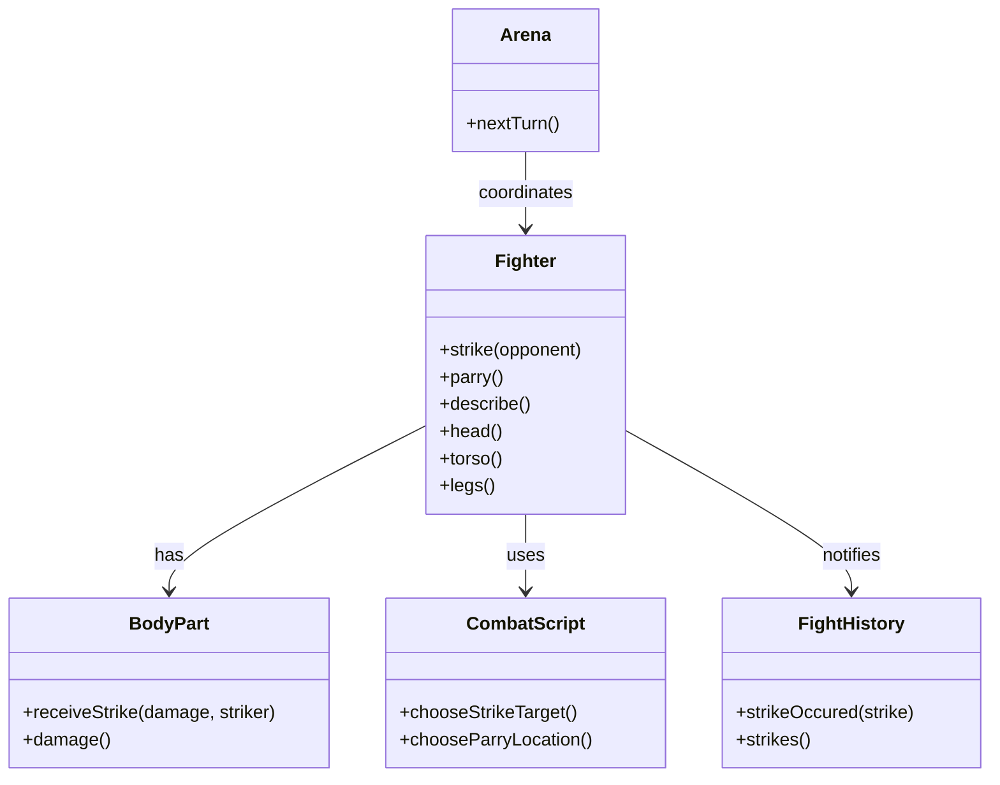

# Implementation Plan

## Goals
- Implement core combat exchange mechanism where two fighters simultaneously parry and strike
- Enable fighters to use scripts for tactical decisions
- Implement body part damage system with multipliers
- Record combat exchanges in fight history for future tactical analysis

## Scenario description

Arena coordinates the exchange: Both fighters simultaneously decide which body part to parry (by asking their scripts) and then strike their opponents - target body parts are also chosen by scripts. Alice chooses to parry her torso, and Bob chooses to parry his head. Alice strikes Bob's head, and Bob strikes Alice's legs. Alice's head strike is completely negated by Bob's successful parry, while Bob's leg strike connects and deals damage to Alice's legs according to the leg's damage multiplier. This exchange is recorder in combat history, making it available for future tactical decisions.

## Design

### Diagram

### Implementation details

- Body parts have damage multipliers: Head (high), Torso (medium), Legs (low)
- Parrying completely negates incoming strikes to that body part
- Combat scripts make tactical decisions based on fight situation
- Fight history observes and records all combat events
- Arena manages turn sequence and fighter coordination

## Tests to Implement:
- [ ] unparriedStrikeDealsDamage
- [ ] parriedStrikeDealsNoDamage
- [ ] fighterDescribesDamageStatusAfterExchange
- [ ] fightHistoryRecordsSimultaneousExchange
- [ ] arenaExecutesSimultaneousExchange
