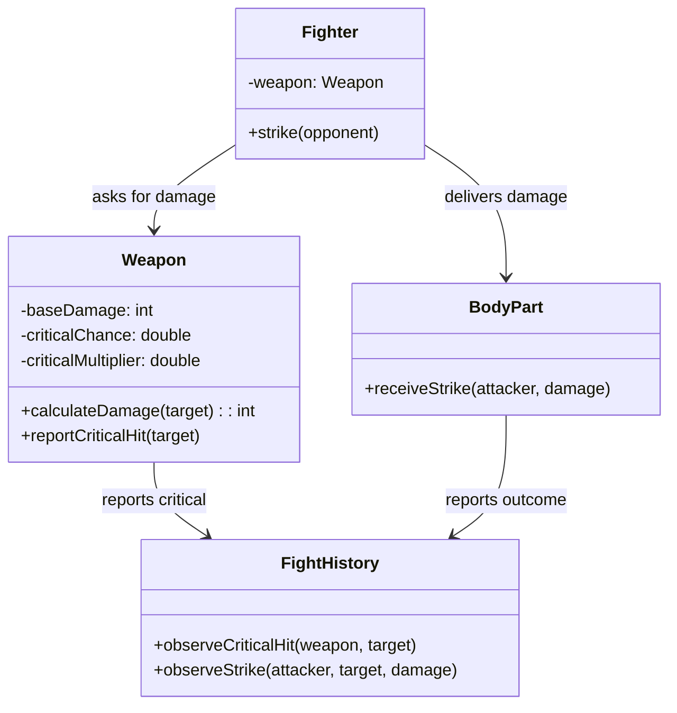

# Implementation Plan — Iteration: Fighters Use Weapons

## Goals

1. Fighters can wield weapons (sword, axe, spear) or fight bare-handed with fists.
2. Each weapon type has distinct base damage and critical hit characteristics.
3. Weapons determine critical hits and amplify damage when they occur.
4. Fight history captures weapon types and critical strikes in the combat narrative.

## Scenario description

When a Fighter strikes, it asks its Weapon to calculate the damage for the target body part. The Weapon determines whether this strike is a critical hit based on its intrinsic critical chance. If critical, the Weapon amplifies the base damage by its multiplier. The Weapon then reports the critical hit event to FightHistory observers if one occurred. The calculated damage flows to the target BodyPart, which receives the strike and takes damage as before. FightHistory observes both the Weapon's critical hit notifications and the BodyPart's damage events, weaving weapon identity and critical strikes into the turn-by-turn narrative.

## Design

### Diagram

### Implementation details

- Bare-handed fighting is modeled as a Weapon with low base damage and no critical chance.
- Weapon types: Sword (moderate damage, elevated critical chance), Axe (high damage, no criticals), Spear (moderate damage, rare criticals), Fists (low damage, no criticals).
- Weapon determines critical hit internally; BodyPart receives only the final damage value.
- Consider how to handle the situation where a weapon is asked for damage multiple times in the same turn. Should FightHistory handle events idempotently?
- Put all weapons into a `weapons` package with separate interface (Fowler pattern).

## Tests to Implement (TDD)

## Next
- Prompt to generate test plan.
- Review (and use?) PlatformPlatform rules
- Consider throwing out weapons classes and just using a generic Weapon with parameterized constructor.
- Weapons. Use them in tests where nextTurn() has to be called manually because otherwise there would be too many turns.