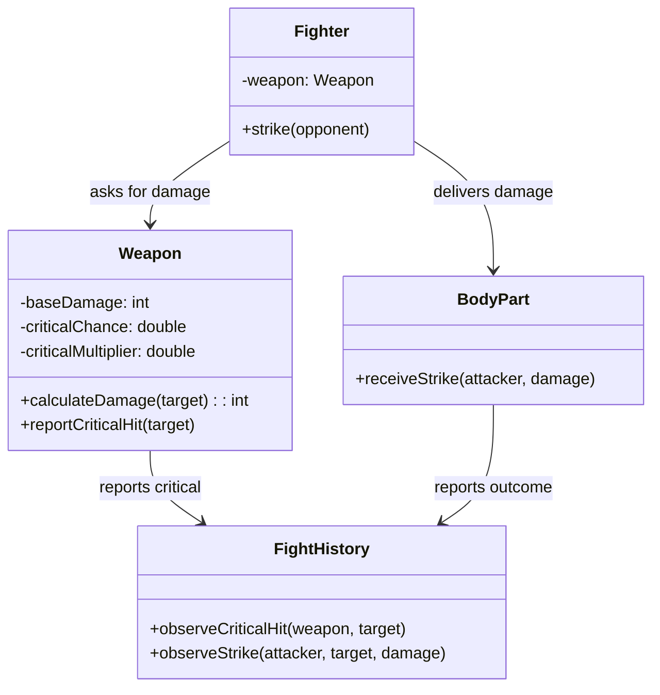

# Implementation Plan — Iteration: Fighters Use Weapons

## Goals

1. Fighters can wield weapons (sword, axe, spear) or fight bare-handed with fists.
2. Each weapon type has distinct base damage and critical hit characteristics.
3. Weapons determine critical hits and amplify damage when they occur.
4. Fight history captures weapon types and critical strikes in the combat narrative.

## Scenario description

When a Fighter strikes, it asks its Weapon to calculate the damage for the target body part. The Weapon determines whether this strike is a critical hit based on its intrinsic critical chance. If critical, the Weapon amplifies the base damage by its multiplier. The Weapon then reports the critical hit event to FightHistory observers if one occurred. The calculated damage flows to the target BodyPart, which receives the strike and takes damage as before. FightHistory observes both the Weapon's critical hit notifications and the BodyPart's damage events, weaving weapon identity and critical strikes into the turn-by-turn narrative.

## Design

### Diagram

### Implementation details

While implementing code changes to make tests pass, or during refactoring phase, find opportunities to implement the following (but don't try to do it all at once):
- Single `Weapon` class with constructor parameters: name (String), baseDamage (int), criticalChance (double), criticalMultiplier (double)
- Weapon name is used in fight history descriptions (e.g., "strikes with sword")
- Bare-handed fighting is modeled as a Weapon with same base damage as now (3) and no critical chance: `new Weapon("fists", 3, 0.0, 1.0)`
- Example weapons:
  - Sword: `new Weapon("sword", 8, 0.25, 2.0)` - moderate damage, 25% crit chance, 2x multiplier
  - Axe: `new Weapon("axe", 12, 0.0, 1.0)` - high damage, no criticals
  - Spear: `new Weapon("spear", 8, 0.1, 1.5)` - moderate damage, rare crits
- For testing critical hits deterministically:
  - Use weapons with 100% crit chance to guarantee crits: `new Weapon("test-sword", 8, 1.0, 2.0)`
  - Use weapons with 0% crit chance to guarantee no crits: `new Weapon("test-axe", 12, 0.0, 1.0)`
- Weapon determines critical hit internally; BodyPart receives only the final damage value.
- Consider how to handle the situation where a weapon is asked for damage multiple times in the same turn. Should FightHistory handle events idempotently?

## Tests to Implement (TDD)

- [x] **Sword deals moderate base damage**
  - Observable: Weapon with baseDamage=8 deals 8 damage to unparried body part (before multipliers)
  - Maps to: Weapon's "calculate strike damage" responsibility
  - Test class: DuelTest
  - Weapon construction: `new Weapon("sword", 8, 0.0, 1.0)` (0% crit for deterministic test)

- [x] **Axe deals highest base damage**
  - Observable: Weapon with baseDamage=12 deals more damage than sword's 8
  - Maps to: Weapon's "calculate strike damage" responsibility
  - Test class: DuelTest
  - Weapon construction: `new Weapon("axe", 12, 0.0, 1.0)`

- [x] **Spear deals moderate base damage**
  - Observable: Weapon with baseDamage=8 matches sword's base damage
  - Maps to: Weapon's "calculate strike damage" responsibility
  - Test class: DuelTest
  - Weapon construction: `new Weapon("spear", 8, 0.0, 1.0)`

- [x] **Weapon with 100% crit chance produces critical hit**
  - Observable: Single strike with critChance=1.0 produces amplified damage
  - Maps to: Weapon's "determine if a strike is critical hit" responsibility
  - Test class: DuelTest
  - Weapon construction: `new Weapon("test-sword", 8, 1.0, 2.0)` (guarantees crit)

- [x] **Fight history captures critical strikes in narrative**
  - Observable: Turn description mentions "critical" when crit occurs
  - Maps to: FightHistory's "record and report critical hits in combat narrative" responsibility
  - Test class: FightDescriptionTest
  - Weapon construction: `new Weapon("sword", 8, 1.0, 2.0)` (100% crit for deterministic test)

- [ ] **Weapon with 0% crit chance never produces critical hits**
  - Observable: Multiple strikes with critChance=0.0 never show "critical" in history
  - Maps to: Weapon's "determine if a strike is critical hit" responsibility
  - Test class: DuelTest
  - Weapon construction: `new Weapon("axe", 12, 0.0, 1.0)` (0% crit chance)

## Next
- Weapons. Use them in tests where nextTurn() has to be called manually because otherwise there would be too many turns.