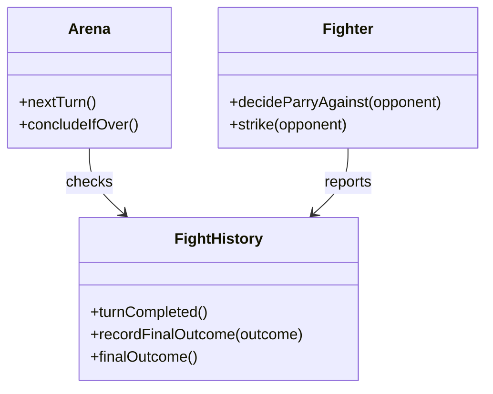

# Implementation Plan — Iteration: 

## Goals

- End the duel strictly at end-of-turn when ≥1 fighter’s HP ≤ 0.
- Support double-death outcome and record it neutrally in history.
- Preserve simultaneity: both strikes resolve before death is checked.

## Scenario description

Two fighters trade simultaneous blows, each choosing a strike and a parry without seeing the other’s choice. Parry fully negates damage to its spot; otherwise damage lands. After both strikes resolve, hit points are tallied and only then the duel ends if one or both have fallen to zero or below. The fight history narrates each exchange plainly and marks the ending (single survivor or both died) without changing style.

## Design

### Diagram

### Implementation details

- History must expose or be extended to record a final outcome label (single survivor / both died) and final HP snapshot per fighter.
- Arena’s turn loop must avoid mid-turn death checks; conclusion happens only after both strikes resolve.

## Tests to Implement (TDD)

- [ ] ends after single death at end of turn
  - Assert: history shows conclusion with one fighter at ≤ 0 HP and no further turns recorded
- [ ] both die in the same turn
  - Assert: history’s final entry states “both died” (or equivalent) and no further turns recorded
- [ ] lethal strike still lands before death is checked
  - Assert: in the lethal turn, both strikes are recorded (hit/parried + damage) before the conclusion line
- [ ] history records final outcome with final hit points
  - Assert: final turn includes explicit final HP per fighter alongside outcome wording
- [ ] arena stops advancing after conclusion
  - Assert: calling next turn after conclusion does not add another completed turn to history
- [ ] turn numbering remains consistent up to final turn
  - Assert: describeTurn(n) returns the last resolved turn; n+1 is unavailable after conclusion

## Notes